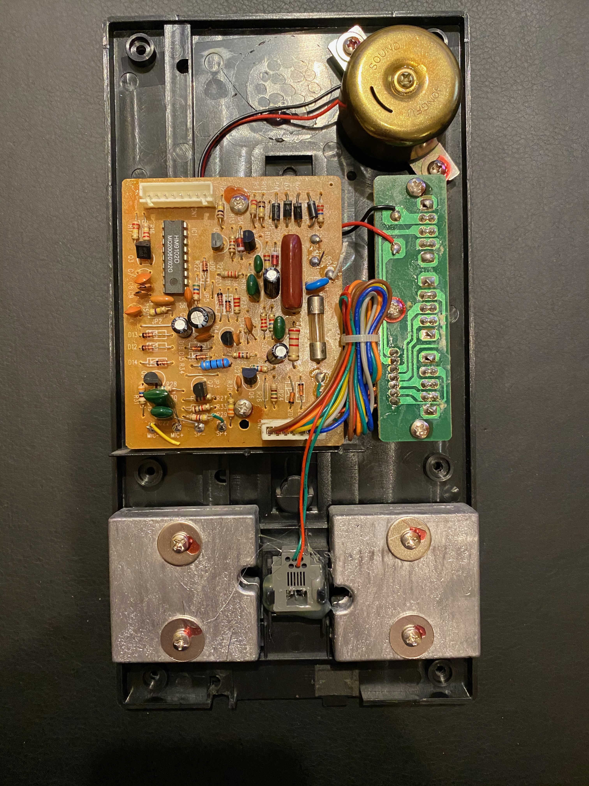

# SonosPhone
Hacked an old phone to control Sonos system with Alexa and keypad.

I've had an antique-looking phone for a while, it looks like an old rotary phone, but it has a touch-tone dial pad. Since I haven't had a standard (POTS) line for some time, I thought I'd turn it into a project.

Step one was to gut the phone and put in a Raspberry Pi Zero, add a power source, wire it up so the handset's microphone and speaker work with the Pi, and make the phone hook trigger an event on the Pi so we know when someone has lifted or set down the receiver.

I loaded the Pi with [AlexaPi](https://github.com/alexa-pi/AlexaPi) and made one feature change to the code. I didn't want to have the microphone always-on or use a "wake" word, so I modified AlexaPi to only listen when I take the phone off-hook. 

This worked out pretty well. Now anytime I wanted to play music I could lift up the phone and say "play classical music in the kitchen". Alexa would do her magic and music would (usually) start playing. All of the other Alexa functions could be heard through the handset, so you could ask for the weather or a joke to play, and that would play through the handset speaker.

## The Phone
The phone is a [Crossley CR55-BK](http://www.crosleyradio.com/telephones/product-details?productkey=CR55&model=CR55-BK). When taking it apart, the first thing you notice is that it is loaded with about 1.5 lbs of lead. This gives the phone a lot of heft and makes it feel like a classic, indestructible Bell telephone. I removed the lead from the phone body but kept it in the handset. I gutted everything else from the inside of the phone, including the ringer, and then cut out as many mounting pegs as I could. Removing the mouth and earpieces from the phone was troublesome. Lots of glue, but they did come off eventually. 

## Wiring the handset
It was unlikely that the existing microphone and speaker would work (and they didn't), so I replaced them. I kept the wiring intact, but removed the microphone and speaker, soldering in an 8 ohm, 2W [speaker](https://www.amazon.com/gp/product/B0177ABRQ6/ref=ppx_yo_dt_b_search_asin_title?ie=UTF8&psc=1) and added an [amplifier](https://www.amazon.com/gp/product/B00PY2YSI4/ref=ppx_yo_dt_b_search_asin_title?ie=UTF8&psc=1) to the Pi.

I had a difficult time finding a microphone that would work, so I tried an experiment with something really cheap in case it failed. I bought a super inexpensive USB [microphone](https://www.amazon.com/gp/product/B077ZBHPJG/ref=ppx_yo_dt_b_search_asin_title?ie=UTF8&psc=1) and basically took the whole thing apart and used its internal components. The USB mic was dismantled to remove the mic and then soldered to the two leads that come from the phone to the USB component. This basically puts a long wire on the mic. The mic was then placed in the handset and soldered.

## Wiring the hook
Internally, the phone hook is just a switch with two wires, so this was easy to wire to the Pi and use GPIO events to know if it was triggered or not. AlexaPi has code for a "push button" to trigger the service, so it was easy to hook into that. Now when the hook is lifted, it triggers listening mode so you can speak the command.

## Phase One Complete!!

So this gave me a cool, retro phone to control Sonos via Alexa. All of the Alexa Sonos commands work and it was often much more convenient than reaching for my phone and bringing up the Sonos app. But for several months of service, the dial-pad was just staring at me doing nothing. I had to change that.

# Phase Two - Pushbutton control

I am by no means a hardware engineer, so circuit design takes a lot of web searches in the hope that I can find someone who has done something similar. Figuring out how the rotary-style keypad worked seemed like a daunting task as I hadn't come across any other keypad like it. It has eight wires coming out of it. As it turns out, even though it is in a circular layout, the keypad works like many other keypads. The wires correspond to rows and columns. For any button press, two of the wires become "active". I brought out an ohmmeter and started testing. 8 wires, many combinations, but eventually found the pattern.

| Digit | Color 1 (row) | Color 2 (col)  |
| ----- |:-------------:|:--------------:|
| 1 | yellow | gray  |
| 2 | yellow | purple|
| 3 | yellow | white |
| 4 | orange | gray  |
| 5 | orange | purple|
| 6 | orange | white |
| 7 | red    | gray  |
| 8 | red    | purple|
| 9 | red    | white |
| * | brown  | gray  |
| 0 | brown  | purple|
| # | brown  | white |

Next, I wired each of these to an open GPIO port on the Pi and wrote some Python code to listen for these key presses. I used a [keypad library](https://github.com/rainierez/MatrixKeypad_Python) as the guts and wrote my button UI to interpret the keypresses. 

# Commands

I wanted the UI to be simple, so buttons 1-8 correspond to Sonos favorites. I just create a Favorite in Sonos and name it Fav1, Fav2, ..., Fav8. This way, you can change the associated music very easily. No coding or configuration file to edit. Just edit the Favorite in the Sonos app itself. Favorites can be anything, a song, an album, a playlist, or even a link to a radio station in one of the Sonos services.

The key-combo 9 + [1-8] corresponds to Sonos Playlists. Again, these use a naming convention of Playlist1, Playlist2, ..., Playlist8. So that gives me 16 presets that are very easy to access. 

The other key commands I have wired up, including '**' for volume up, '*#' for volume down, and '*7' for shuffle.

The zero (0) key toggles play/pause.

## Sonos Controller

When a command is received, we then need to tell Sonos what to do. For that I used the very nice library from @jishi called [node-sonos-http-api](https://github.com/jishi/node-sonos-http-api). This library is a node web service that makes it super easy to control your Sonos. So, when the '1' key is pressed, I send a GET to this web service like `http://localhost:5005/Office/favorite/Fav1`. 

# Phase Three

Yes, there is a phase three. I have it working but don't have the phone mods completed yet. I'll just say this, it uses a camera, but the camera is inside the phone. I'm really excited about this upcoming feature.
